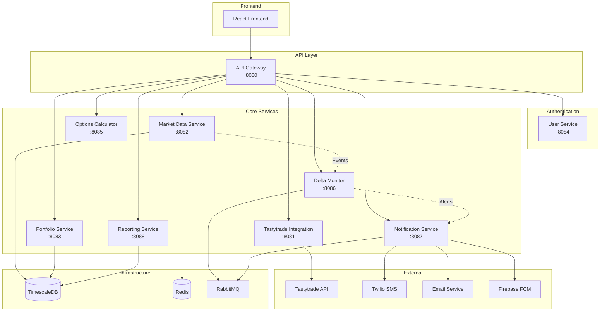
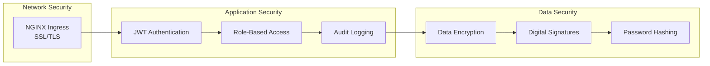

# Service Architecture Diagram

## High-Level Architecture

## Service Communication Patterns

### Synchronous Communication
- Frontend ↔ API Gateway (HTTP/REST)
- API Gateway ↔ Services (HTTP/REST)
- Services ↔ External APIs (HTTP/REST)

### Asynchronous Communication
- Market Data → Delta Monitor (Events)
- Delta Monitor → Notification Service (Alerts)
- Portfolio Service → Audit Service (Transactions)

### Real-time Communication
- Market Data Service → Frontend (WebSocket/SSE)
- Notification Service → Frontend (WebSocket)

## Data Storage Strategy

### TimescaleDB (Primary Database)
- Market data time-series
- Transaction history
- User accounts and positions
- Audit logs

### Redis (Cache & Sessions)
- Session management
- Real-time quotes cache
- Delta thresholds
- Rate limiting counters

### RabbitMQ (Message Broker)
- Market data events
- Alert notifications
- Audit events
- System notifications

## Security Layers

